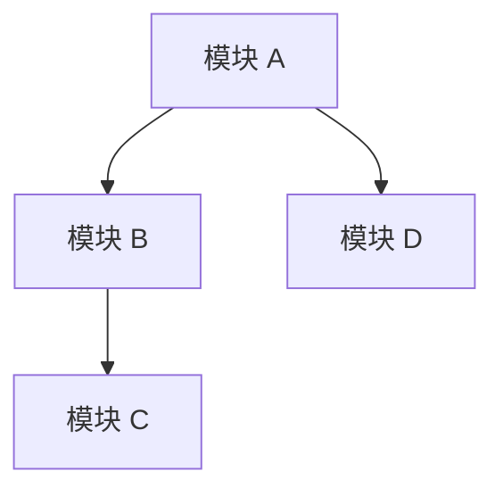
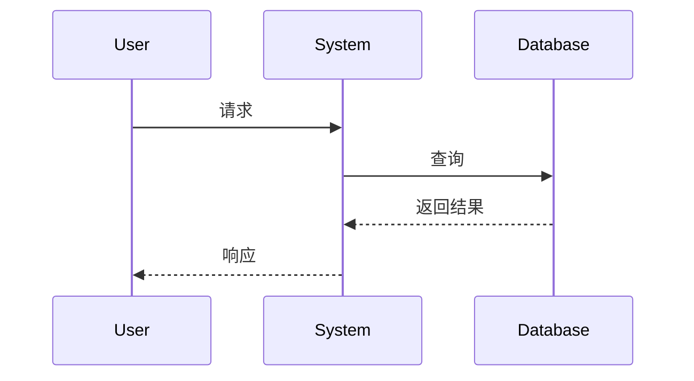
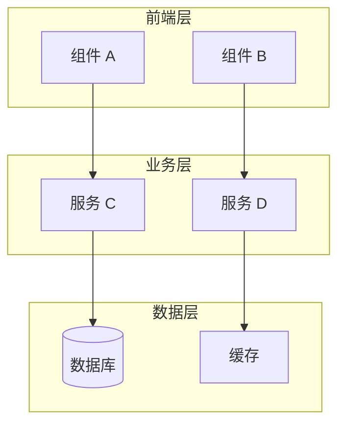
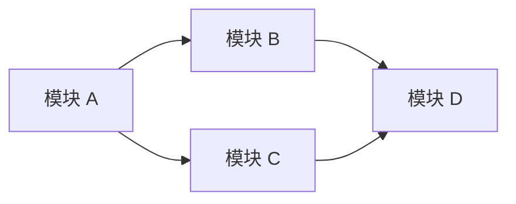
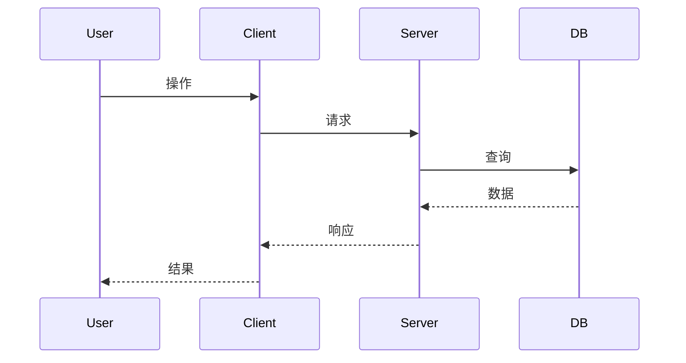
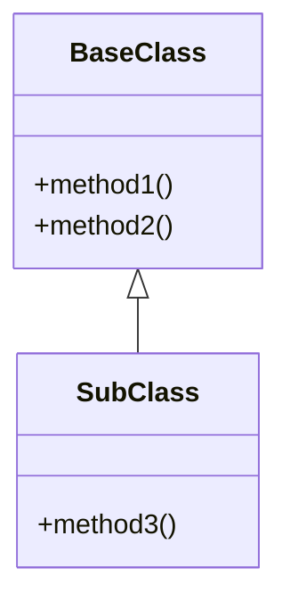

# GitHub 源码解读报告模板

## 报告结构建议

### 源码解读报告 (<repo_name>_源码解读.md)

```markdown
# <项目名称> 源码解读

## 项目基本信息

- **仓库地址**: https://github.com/<user>/<repo>
- **Star 数**: xxx
- **最后更新**: YYYY-MM-DD
- **项目描述**: (来自 README)
- **技术栈**: (语言、框架、关键依赖)

## 一句话总结

(用一句话概括这个项目的核心价值和特点)

## 使用场景

### 这个项目解决什么问题

(描述项目的核心问题域)

### 适用场景

- 场景 1: ...
- 场景 2: ...
- 场景 3: ...

### 典型应用案例

(如果 README 或文档中有案例，列出；如果没有，可以推测典型用法)

## 优点与缺点

### 优点

1. **优点 1**: 详细说明
2. **优点 2**: 详细说明
3. **优点 3**: 详细说明

### 缺点

1. **缺点 1**: 详细说明
2. **缺点 2**: 详细说明
3. **缺点 3**: 详细说明

## 核心原理

### 整体架构



### 关键模块

#### 模块 1: <模块名称>

- **职责**: ...
- **实现方式**: ...
- **技术选型**: ...

#### 模块 2: <模块名称>

- **职责**: ...
- **实现方式**: ...
- **技术选型**: ...

### 数据流



### 算法或核心逻辑

(如果有核心算法，详细说明；如果没有，说明核心业务逻辑)

## 设计思想

### 代码组织方式

- 目录结构说明
- 模块划分原则
- 关注点分离策略

### 设计模式应用

- 使用的设计模式
- 模式的应用场景
- 带来的好处

### 抽象层次划分

- 接口/抽象层
- 实现层
- 工具/辅助层

### 扩展性考虑

- 插件机制
- 配置化设计
- 扩展点设计

## 对悟鸣的启发

### 结合当前岗位

(基于 AI 应用、Agent 开发、工具链建设等角度)

### 结合最近研究方向

(基于 Agent Skills、MCP、AI 协作等方向)

### 可借鉴的设计思路

1. **设计点 1**: 具体说明
2. **设计点 2**: 具体说明

### 可应用到自己的项目

- 在 [具体项目] 中可以借鉴 [具体方法]
- 在 [具体场景] 下可以应用 [具体设计]

## 术语解释

| 术语 | 解释 |
|------|------|
| Term 1 | 解释 1 |
| Term 2 | 解释 2 |
| Term 3 | 解释 3 |

## 复查记录

### 2026-03-13 初版
- 完成 xx 分析
- 补充 xx 细节
- 修正 xx 问题

### 2026-03-13 复查 1
- 补充架构图
- 优化使用场景描述
```

### 快速上手文档 (<repo_name>_快速上手.md)

```markdown
# <项目名称> 快速上手

## 环境要求

- **操作系统**: macOS / Linux / Windows
- **语言版本**: Node.js 18+ / Python 3.10+ / Rust 1.70+
- **其他工具**: Git / Docker (如需要)

## 安装步骤

### 1. 克隆仓库

```bash
cd ~/Documents/coding/github
git clone https://github.com/<user>/<repo>.git
cd <repo>
```

### 2. 安装依赖

```bash
# Node.js 项目
npm install

# Python 项目
pip install -r requirements.txt

# Rust 项目
cargo build --release
```

### 3. 配置说明

(如果需要配置文件或环境变量)

```bash
# 复制配置文件模板
cp config.example.json config.json

# 或设置环境变量
export API_KEY=your_key
```

## 快速体验

### 最小可运行示例

```bash
# 示例 1: 基本功能
npm run example:basic

# 示例 2: 完整流程
npm run example:full
```

**预期输出**:

```
(粘贴实际运行输出)
```

### 核心功能演示

(展示 2-3 个核心功能的使用)

#### 功能 1: <功能名称>

```bash
命令示例
```

**说明**: ...

#### 功能 2: <功能名称>

```bash
命令示例
```

**说明**: ...

## 常见问题

### Q1: 安装依赖时报错

**问题**: 错误信息

**解决方法**:

1. 方法 1
2. 方法 2

### Q2: 运行时找不到模块

**问题**: 错误信息

**解决方法**:

1. 检查 ...
2. 重新安装 ...

### Q3: 权限问题

**问题**: 错误信息

**解决方法**:

1. 使用 sudo
2. 修改文件权限

## 下一步学习

### 推荐阅读的源码文件

1. **入口文件**: `src/index.ts` / `main.py` / `src/main.rs`
   - 说明：程序入口，了解启动流程

2. **核心模块**: `src/core/` / `lib/`
   - 说明：核心实现逻辑

3. **工具模块**: `src/utils/` / `utils/`
   - 说明：辅助工具函数

### 关键模块的入口

- **模块 A**: 从 `src/a.ts` 开始
- **模块 B**: 从 `src/b.ts` 开始

### 实验建议

1. 修改配置，观察效果
2. 尝试扩展功能
3. 编写测试用例

## 参考资源

- 官方文档: ...
- API 文档: ...
- 示例代码: ...

## 复查记录

### 2026-03-13 初版
- 完成安装步骤验证
- 补充常见问题
```

## Mermaid 图建议

### 架构图



### 模块关系图



### 时序图



### 类图


