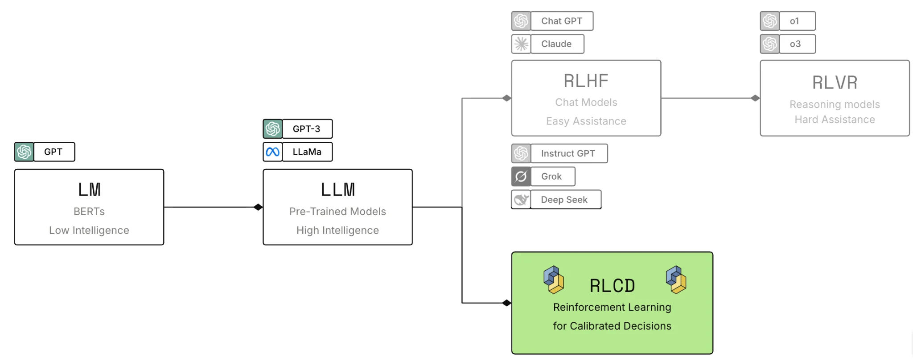
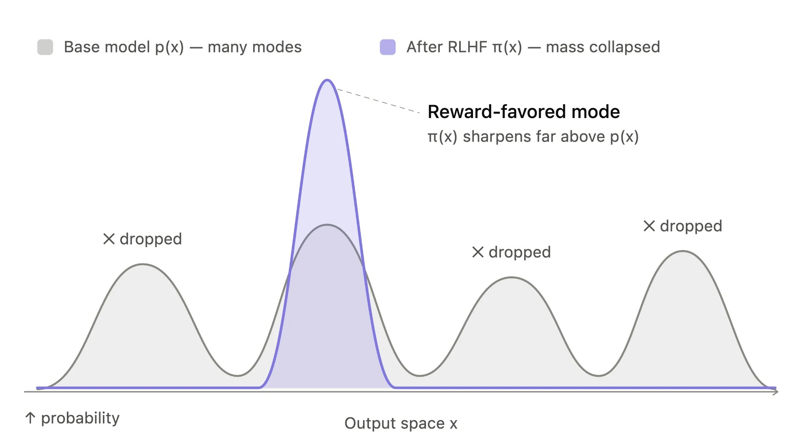
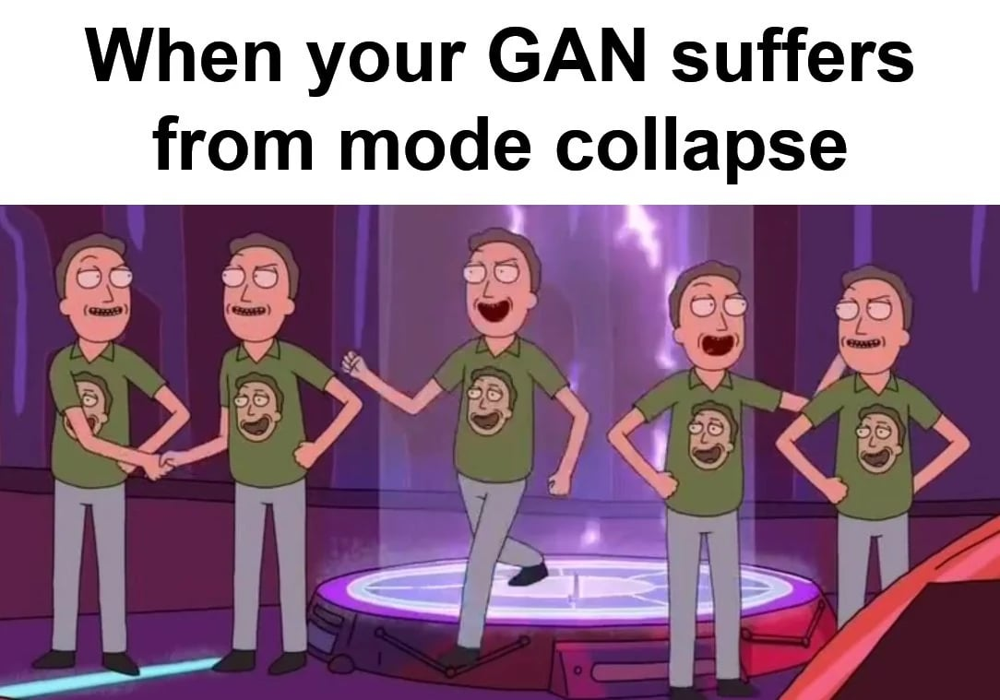

# AI primer

> Why TypeSafe trains decision models with calibrated probabilities instead of optimizing for generated text.

Most AI products are built around a conversation between a model and a person. TypeSafe starts from a different bet: large-scale automation will be dominated by AI-to-AI and AI-to-software interactions, so the machine interface matters more than the chat interface.

> **We call this Machine Native Intelligence:**
>
> AI with software-like properties such as structure, reliability, observability, testability, speed, consistency, and low cost.

## Building prod, not God

TypeSafe is not trying to build a model that does everything. It is designed for production systems where code needs a narrow decision it can inspect and act on.

Our expectation is that large-scale AI automation will be closer to 99% machine-to-machine interactions and 1% human interaction. That shifts the design target from responses that feel good to read toward outputs that behave predictably inside software.

Read the [TypeSafe manifesto](https://typesafe.ai/manifesto).

## Three post-training approaches

Pretrained language models have been adapted in two major ways. TypeSafe adds a third. RLHF and RLVR are shown here for context; TypeSafe's training path is RLCD.

  - **RLHF**: **Reinforcement learning from human feedback** turned pretrained models into chatbots. It trains models to produce responses people prefer.

  - **RLVR**: **Reinforcement learning with verifiable rewards** created reasoning models that are strong at tasks such as mathematics, but slower and more expensive.

  - **RLCD**: **Reinforcement learning for calibrated decisions** trains TypeSafe to return decisions and calibrated probabilities instead of generated text.

RLHF was used to train InstructGPT and ChatGPT and was [co-invented by Diogo Almeida](https://scholar.google.com/citations?user=0T4y07QAAAAJ\&hl=en), cofounder of TypeSafe.

  

  <!-- Pretrained language models branch into muted RLHF and RLVR paths and an emphasized RLCD decision-model path. -->

## RLCD and calibrated decisions

RLCD optimizes for a different output contract:

* The model does not generate text.
* It returns decisions and probabilities.
* Higher probability should correspond to a greater chance that the answer is correct.

Calibration makes uncertainty usable by software. Across many predictions from a well-calibrated model:

* Outcomes assigned a probability of `0.2` should occur about 20% of the time.
* Outcomes assigned a probability of `0.8` should occur about 80% of the time.
* Outcomes assigned a probability of `1.0` should occur 100% of the time.

These rates describe groups of predictions, not a guarantee about any single answer. See [Confidence](../Concepts/Confidence.md) for guidance on deciding when software should act or escalate.

## The problems with RLHF

RLHF teaches a model to say things that people prefer. That objective works well for chatbots, but it can also reward sycophancy and confident-sounding hallucinations.

Preference optimization also causes **mode dropping**: the model learns to favor a particular style, such as instruction following, while reducing the probability of other possible outputs.

  

  <!-- The probability distribution of a base model compared with a narrowed, mode-dropped distribution after RLHF. -->

**Warning:**

An output can be compelling to a person without being reliable enough for unattended automation. Human preference and machine trustworthiness are different optimization targets.

Mode dropping is a milder version of **mode collapse**. In the classic generative-adversarial-network failure mode, a generator learns to produce the same kind of output repeatedly because that output continues to fool the discriminator.

#### Mode collapse analogy

    

    <!-- Repeated characters illustrate a GAN suffering from mode collapse. -->

RLHF remains a good fit for conversational models. TypeSafe's position is that production automation needs a different training objective—one centered on constrained decisions and calibrated uncertainty.
